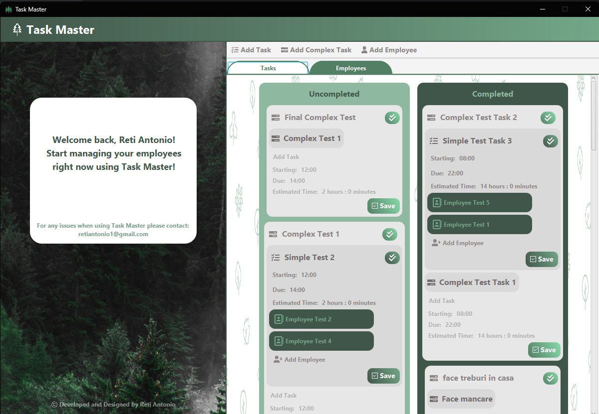
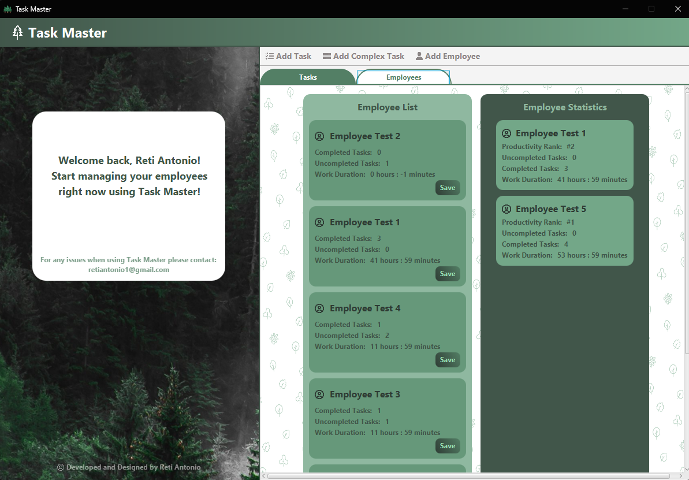

<h1>Task Management App developed with Java and JavaFX</h1>
Developed a full-stack task management application (Jira-like) with a Java backend and JavaFX frontend, featuring
recursive task hierarchies where complex tasks can contain
simple and nested complex tasks, employee work time
tracking, task time planning and interactive UI components.

<h2>App Design / Screenshots</h2>

<h3>"Auth" Menu</h3>

<h3>Main Menu / Task Management Menu</h3>

<h3> Employee Management Menu</h3>

